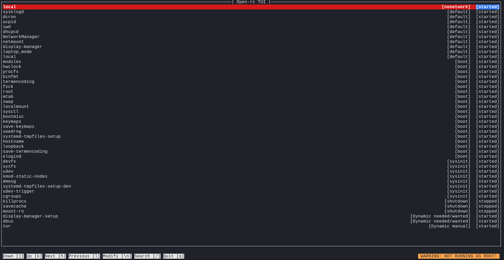

# rc-tui
> Terminal User Interface for a subset of common open-rc operations

### Features
+ list and search all system services
+ adjust runlevel
+ stop/start/restart service

### Bugs
+ on every even call new\_menu fails; which is funny, because i made this project to try out menu.h
